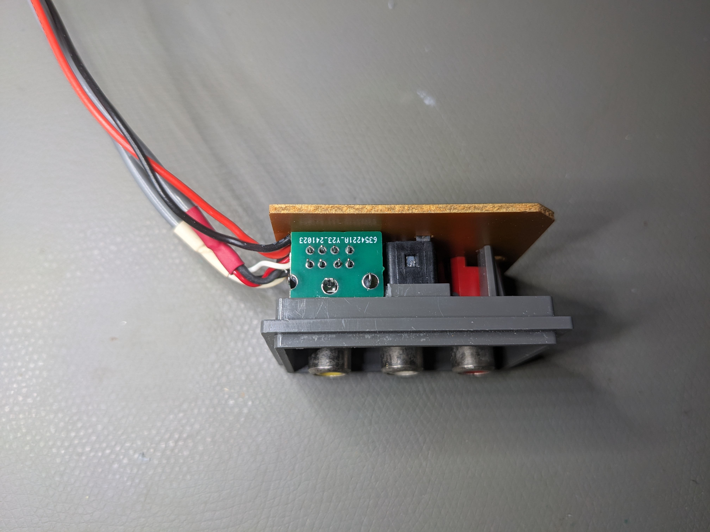

# PC Engine IFU-30 RGB Amp w/ MiniDIN-8 port

A THS7374 based RGB amp w/ MiniDIN-8 port to fit in the IFU-30(A) or TG16-CD connector panel.
Schematics are identical to my [Universal RGB Amp](https://github.com/herr-g/pcergb_pub) but with added audio lines and footprint for a MiniDIN-8 AV-port.
AV-port pinout is similar to Framemeister, NESRGB etc. ([Reference](https://tms-rgb.com/media/connection8.png))

My goal was to reduce any case modifications to a minumum while retaining all the original connectors.
This solution includes two PCBs: A main pcb and an extension pcb to fill 2mm of free space between the pcb and the designated position in the IFU connector frame.

The 4-channel RGBS Amp is based on Voultars schematic:\
- THS7374 quad-amp  
- Input pullups via 1.8k/10k voltage dividers  
- 75R and 220uF caps inline on the outputs  
- LPF optional via solder bridge on JP1  

Recommended PCB thickness:
- main: 0.8mm
- 2x extension: 1mm (2x 1mm pcbs are reasonably cheaper to order than 1x 2mm) 

**Note for JLCPCB**: Set the option 'Remove Order Number' to 'Specify a location' and the order number will be hidden under the bottom right tantalum cap.

Finished Installation

The output voltage was measured at exactly 0,7Vpp (75R termination)

Test pattern using 240p Test Suite

## Installation Instructions

1. Remove the IFU-30 connector panel assy:
	-	Remove the upper Cover (3x Gamebit 4.5mm screws).
	-	Disconnect the 3 main PCB Connectors (power LED, power switch, connector panel assy).
	-	Remove main PCB (2x Philips screws).
	-	IFU-30A only: Remove additional GND connector under main PCB (1 Philips screw).
	-	Remove connector panel assy.
2. Desolder the connector panel PCB, heat the plastic holders with a hot air gun and remove the connector PCB from the connector terminals.
3. Cut the plastic spacer under the yellow connector as shown:

4. Drill a hole on the designated position and file it to the exact size of the MiniDIN connector. The outer bottom and right edges (looking from the outside) have to be fully cut down to the outer frame. Check the size and position carefully with the MiniDIN connector and the unsoldered ifurgb PCB.
  
  
5. Prepare 3 random plastic pieces of 2mm thickness to act as spacers for the MiniDIN connector so the connector will stay in place reliably. Use some hot glue to affix two plastic spacers right at the yellow connector and the power connector. A third spacer has to be glued at the back of the connector to build a flat surface with the other connectors.  
**Note**: Only the rear spacer is glued directly to the MiniDIN connector while the other two should be glued to the existing connectors.
  
6. Double-check the exact connector position. Apply some hot air if necessary to soften the hot glue and re-position the spacers.

7. Losely attach one of the spacer PCBs, Apply some hot glue on the back of the connector and attach the connector PCB. If everything fits as desired solder the connector PCB.
  
8. Attach some double sided tape to help the ifurgb main PCB to stay in position. Add the second spacer PCB and the ifurgb main PCB and solder the MiniDIN connector to the ifurgb.
 
9. Wire the two audio channels to the corresponding solder connections on the ifurgb.
 
10. Cut roughly 2mm from the right plastic holder of the bottom shell to give the MiniDIN connector housing enough space. Verify the customized connector panel assy fits in position.

11. Wire the ifurgb solder pads to the corresponding pins on the Ext. Bus connector as shown.
 
12. Put everything back together and enjoy ^^